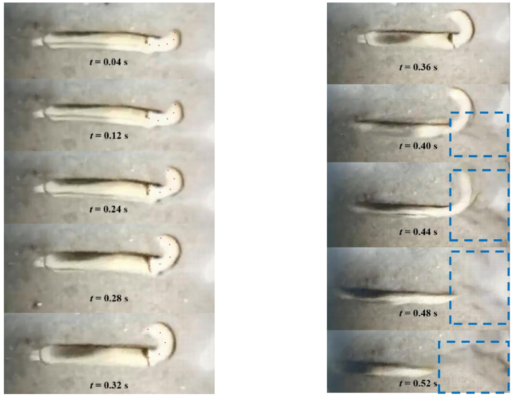
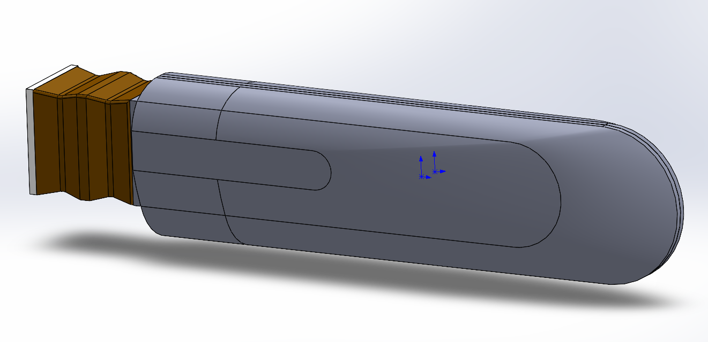
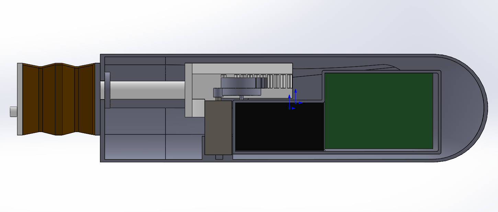
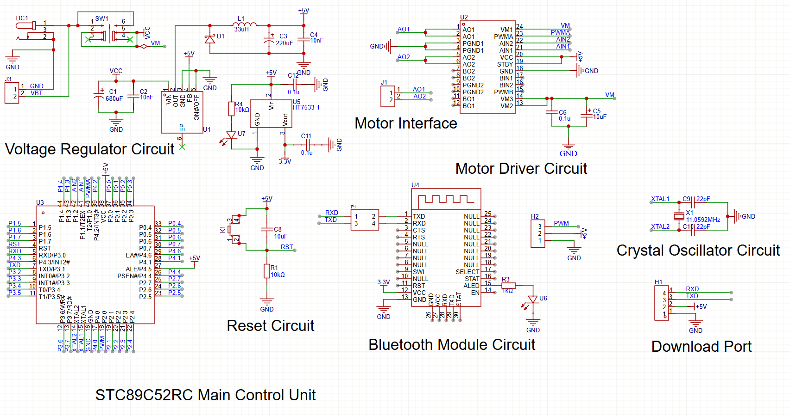
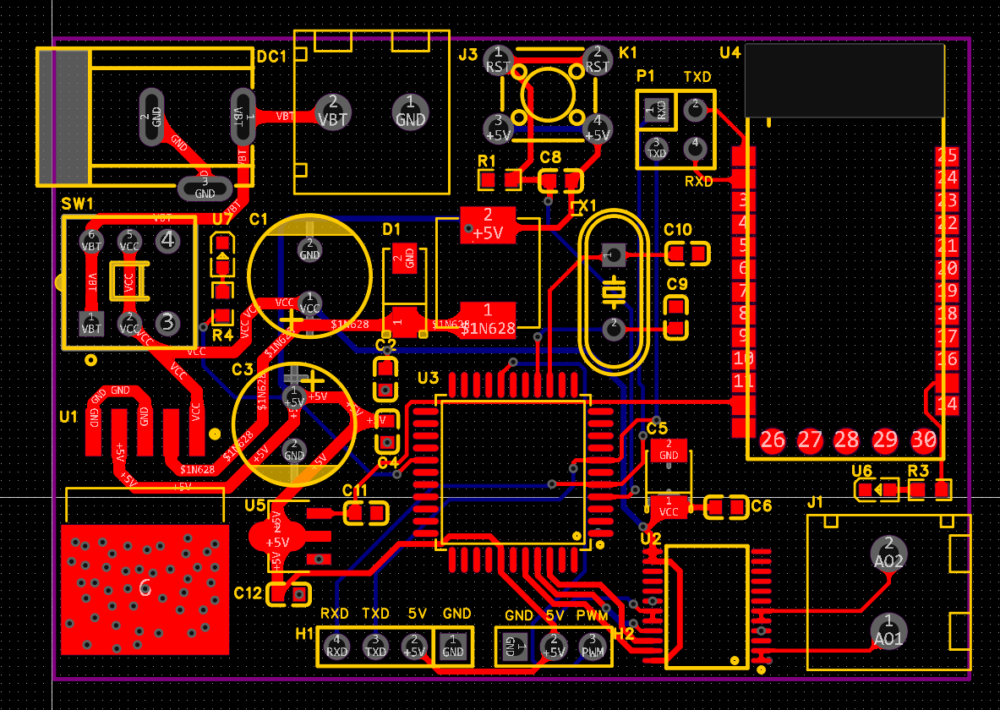

# Bionic Razor-Clam-Inspired Jet-Propelled Underwater Robot  

A research project exploring jet propulsion in bionic underwater robots, inspired by the razor clam (Solen strictus).  
Two different propulsion mechanisms were designed, simulated, and tested to study bio-inspired jet locomotion and its efficiency in underwater movement.  

---

## Table of Contents
1. [Project Overview](#project-overview)  
2. [Bio-Inspiration and Motivation](#bio-inspiration-and-motivation)  
3. [Design Concepts](#design-concepts)  
4. [Electronic Circuit and PCB Design](#electronic-circuit-and-pcb-design)  
5. [Experimental Testing](#experimental-testing)  
6. [Results and Discussion](#results-and-discussion)  

---

## Project Overview  

This repository accompanies the research *“Design and Control of a Razor-Clam-Inspired Jet-Propelled Robotic Fish.”*  
The goal is to replicate the razor clam’s unique foot whipping and water-jet propulsion mechanism, which allows rapid escape movement (~50 cm/s).  

Key highlights:  
- Dual propulsion prototypes based on different contraction mechanisms  
- 3D CAD design and modular prototyping in SolidWorks  
- Microcontroller-based actuation and Bluetooth remote control  
- Experimental comparison of two propulsion architectures 

---

## Bio-Inspiration and Motivation  

Razor clams exhibit a **composite propulsion** combining:  
1. **Foot whipping**: rotates the body 90° about the longitudinal axis  
2. **Jet ejection**: mantle contraction expels stored water through the siphon  

Razor clams and other bivalves achieve short-range escape or burrowing motion by cyclically ejecting water and retracting their bodies. This principle inspired the design of two robotic prototypes that mimic the same contraction–ejection pattern, translating internal volume change into thrust.

*Example schematic of the clam motion:*  
  

---

## Design Concepts

### 1. Shell-Closure Jet Propulsion System

This design mimics the mantle contraction of the razor clam.  
A pair of permanent magnets mounted on the upper shell and motor rotor alternate between attraction and repulsion to open and close the shell.

- **Structure:** upper, lower shells and flexible sealing film  
- **Drive:** DC motor → rotor → magnetic actuation  
- **Function:** cyclic compression of the internal water chamber to generate jet thrust  
- **Control:** STC89C52RC microcontroller + Bluetooth module  

---

### 2. Tubular Origami Jet Propulsion System

The second design imitates the foot contraction of the razor clam using a tubular origami mechanism with spring energy storage.  
A gear-rack system driven by an N20 motor compresses the origami structure to expel water and generate thrust.

- **Structure:** origami tube, spring and gear-rack linkage  
- **Drive:** motor → half gear → linkage → spring compression  
- **Function:** pulse-type jet propulsion with larger water-volume change
- **Control:** STC89C52RC microcontroller + Bluetooth module     

---

## Electronic Circuit and PCB Design  

The control system of the robot is built around an STC89C52RC microcontroller, which manages motor actuation and wireless communication through a Bluetooth module. Users can remotely control the motor’s rotational speed via a smartphone Bluetooth app, sending PWM commands to adjust the propulsion strength in real time.

The circuit integrates voltage regulation, motor driver, Bluetooth serial communication, and programming interfaces on a compact 2-layer PCB. This design ensures stable power delivery, minimal wiring, and reliable wireless control for both prototypes.

---

## Experimental Testing  

Both prototypes were fabricated via 3D printing and tested in a 1 m × 0.3 m × 0.3 m tank.  
Tests were video-recorded, and displacement was measured frame-by-frame.

### Prototype 1: Shell Closure Type
| Motor Speed (r/min) | Avg. Velocity (mm/s) |
| -------------------- | -------------------- |
| 30 | 4.0 |
| 60 | **19.3** |
| 90 | 12.4 |

### Prototype 2: Origami Jet Type
| Motor Speed (r/min) | Avg. Velocity (mm/s) |
| -------------------- | -------------------- |
| 30 | 7.5 |
| 60 | **28.1** |
| 90 | 21.7 |

**Observation:**  
The origami-based prototype produced more uniform thrust and better directional stability, while the shell-type design achieved reliable repetitive motion but lower efficiency.

---

## Results and Discussion  

Two propulsion prototypes were developed and tested.  

**Prototype 1 – Magnet-Driven Shell Closure:**  
Using permanent magnets on a motor-driven rotor, cyclic attraction and repulsion generated periodic shell motion for water ejection.  
The system achieved stable jet pulses with a peak speed of **≈ 19 mm/s**, proving the concept feasible but with limited thrust and slower refill.  
Improvements such as stronger magnets, reduced body size, and elastic sealing materials could enhance performance.  

**Prototype 2 – Tubular Origami Jet System:**  
Inspired by the clam’s foot contraction and origami folding mechanics, a spring-assisted compression chamber produced stronger pulsatile jets.  
Tests showed a smoother and faster motion with a peak velocity of **≈ 28 mm/s**, demonstrating better efficiency and stability than the first design.  
 

---

