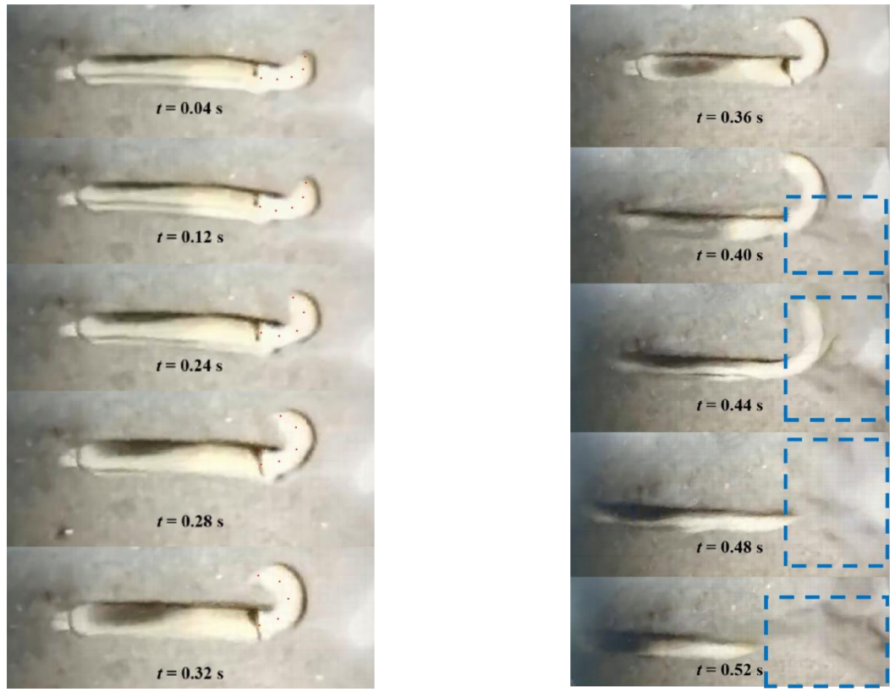

# Bionic Razor-Clam-Inspired Jet-Propelled Underwater Robot  

A research project exploring **jet propulsion in bionic underwater robots**, inspired by the *razor clam (Solen strictus)*.  
Two different propulsion mechanisms were designed, simulated, and tested to study **bio-inspired jet locomotion** and its efficiency in underwater movement.  

---

## Table of Contents
1. [Project Overview](#project-overview)  
2. [Bio-Inspiration and Motivation](#bio-inspiration-and-motivation)  
3. [Design Concepts](#design-concepts)  
4. [Simulation and Analysis](#simulation-and-analysis)  
5. [Experimental Testing](#experimental-testing)  
6. [Results and Discussion](#results-and-discussion)  
7. [Folder Structure](#folder-structure)  
8. [Future Work](#future-work)  
9. [References](#references)  
10.[Acknowledgements](#acknowledgements)

---

## Project Overview  

This repository accompanies the research *“Design and Control of a Razor-Clam-Inspired Jet-Propelled Robotic Fish.”*  
The goal is to replicate the razor clam’s unique **foot whipping and water-jet propulsion** mechanism, which allows rapid escape movement (~50 cm/s).  

Key highlights:  
- Dual propulsion prototypes based on different contraction mechanisms  
- 3D CAD design and modular prototyping in SolidWorks  
- Microcontroller-based actuation and Bluetooth remote control  
- Experimental comparison of two propulsion architectures 

---

## Bio-Inspiration and Motivation  

Razor clams exhibit a **composite propulsion** combining:  
1. **Foot whipping** — rotates the body 90° about the longitudinal axis  
2. **Jet ejection** — mantle contraction expels stored water through the siphon  

Razor clams and other bivalves achieve short-range escape or burrowing motion by cyclically ejecting water and retracting their bodies. This principle inspired the design of two robotic prototypes that mimic the same contraction–ejection pattern, translating internal volume change into thrust.

*Example schematic of the clam motion:*  
  

---

## Design Concepts

### Ⅰ. Shell-Closure Jet Propulsion System

This design mimics the **mantle contraction** of the razor clam.  
A pair of permanent magnets mounted on the upper shell and motor rotor alternate between attraction and repulsion to open and close the shell.

- **Structure:** upper & lower shells + flexible sealing film  
- **Drive:** DC motor → rotor → magnetic actuation  
- **Function:** cyclic compression of the internal water chamber to generate jet thrust  
- **Control:** STC89C52RC microcontroller + Bluetooth module  
- **Simulated speed:** ≈ 19 mm/s  

---

### Ⅱ. Tubular Origami Jet Propulsion System

The second design imitates the **foot contraction** of the razor clam using a **tubular origami mechanism** with spring energy storage.  
A gear-rack system driven by an N20 motor compresses the origami structure to expel water and generate thrust.

- **Structure:** origami tube + spring + gear-rack linkage  
- **Drive:** motor → half gear → linkage → spring compression  
- **Function:** pulse-type jet propulsion with larger water-volume change  
- **Performance:** faster (≈ 28 mm/s), more stable than shell type  

---

## Simulation and Analysis  

CFD simulations were performed using **ANSYS Fluent**.  
Key parameters analyzed:  
- Jet thrust \( F = \dot{m} v_e \)  
- Propulsion efficiency \( \eta = \frac{2U}{v_e + U} \)  
- Pressure and velocity distribution  
- Flow resistance vs nozzle geometry  

*Example Fluent results:*  

**Predicted performance:**  
| Model | Predicted Speed | Notes |
| ------ | ---------------- | ----- |
| Magnet-driven shell | 1.8 cm/s | Stable but low thrust |
| Origami structure | 2.8 cm/s | Stronger impulse, higher efficiency |

---

## Experimental Testing  

**Setup:**  
- Water tank (100 cm × 30 cm × 30 cm)  
- STC89C52RC microcontroller + Bluetooth control  
- N20 reduction motor for actuation  

*Testing snapshot:*  

**Results summary:**  

| Motor Speed (r/min) | Avg. Velocity (mm/s) |
| -------------------- | -------------------- |
| 30 | 4.0 |
| 60 | **19.3** |
| 90 | 12.4 |

---

## Results and Discussion  

- The **magnet-driven design** confirmed feasibility of jet propulsion, though efficiency remained moderate.  
- The **origami-based system** achieved higher propulsion speed and smoother jet pulses.  
- **Optimizing nozzle area** and **membrane elasticity** significantly enhanced thrust.  
- Future improvements may include **miniaturized waterproof electronics** and **adjustable directional control**.  

---

## Folder Structure  

